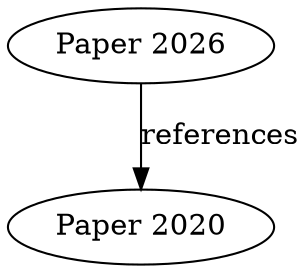

# KuiperDb v0.2.0 Iteration Plan

**Status:** Future Planning  
**Created:** 2026-02-03  
**Current Version:** Phase 3 (Complete)

---

## Overview

v0.2.0 focuses on production optimizations, advanced retrieval techniques, and operational enhancements. All core features (CRUD, search, chunking, knowledge graphs) are complete in Phase 3.

---

## Goals

1. **Advanced Reranking** - Cross-encoder reranking for precision
2. **Index Persistence** - Save/load HNSW to eliminate rebuild time
3. **Semantic Chunking** - Context-aware document splitting
4. **Graph Visualization** - Export knowledge graphs for analysis
5. **Operational Enhancements** - Metrics, monitoring, weighted relationships

---

## Feature Breakdown

### 1. Cross-Encoder Reranking

**Priority:** High  
**Complexity:** Medium  
**Dependencies:** GPU server supporting cross-encoder models

#### Description
After initial retrieval (BM25 + vector), rerank top-K results using cross-encoder for maximum precision.

#### Implementation
- Add cross-encoder API client (similar to embedder)
- Reranking step in search pipeline (optional via config)
- Support for multiple cross-encoder models
- Batch reranking for performance (10-50 pairs at once)

#### Config
```json
{
  "features": {
    "cross_encoder_reranking": true
  },
  "cross_encoder": {
    "enabled": true,
    "api_url": "https://gpu-server/rerank/v1",
    "model": "ms-marco-MiniLM-L-6-v2",
    "top_k": 20,       // Rerank top 20 from initial retrieval
    "timeout_seconds": 10
  }
}
```

#### API Changes
```json
// Search request
{
  "query": "...",
  "type": "hybrid",
  "rerank": true,     // Optional: enable reranking
  "rerank_top_k": 20  // Optional: override config
}
```

#### Performance Target
- Initial retrieval: 100 docs in ~240ms
- Rerank top-20: +100-200ms
- Total: ~400ms for ultra-precise results

---

### 2. HNSW Index Persistence

**Priority:** High  
**Complexity:** Medium  
**Dependencies:** None

#### Description
Save HNSW index to disk, load on startup. Eliminates rebuild time for large datasets.

#### Current Behavior
- 200K docs → ~2-5 minutes rebuild on startup
- Index lost on restart

#### Target Behavior
- Save index to `{db_path}/hnsw_index.bin`
- Load in <10 seconds on startup
- Auto-rebuild if schema changes or corruption

#### Implementation
- Serialize HNSW index using serde/bincode
- Versioning for index format compatibility
- Checksums for corruption detection
- Incremental updates (append-only for new docs)

#### Config
```json
{
  "vector_index": {
    "persist_to_disk": true,
    "index_path": "./data/{db}/hnsw_index.bin",
    "auto_rebuild_on_corrupt": true
  }
}
```

#### Benefits
- **Startup:** 5 minutes → 10 seconds
- **Reliability:** Survive restarts without degradation
- **Operations:** Hot reloads, blue-green deployments

---

### 3. Semantic Chunking (CustomChunker)

**Priority:** Medium  
**Complexity:** High  
**Dependencies:** NLP library (e.g., rust-bert, tokenizers)

#### Description
Context-aware chunking that respects paragraph/sentence boundaries instead of fixed token counts.

#### Current Behavior
- FixedTokenChunker: Hard split at 512 tokens
- May split mid-sentence or mid-paragraph

#### Target Behavior
- Respect paragraph boundaries
- Respect sentence boundaries (if < threshold)
- Semantic similarity-based splitting
- Configurable strategies

#### Strategies

**Paragraph-Aware:**
```
1. Split by paragraph (\n\n)
2. If paragraph > chunk_size, split by sentence
3. If sentence > chunk_size, fall back to token split
```

**Semantic Similarity:**
```
1. Embed sentences
2. Group similar consecutive sentences
3. Create chunks at similarity drops
4. Target chunk_size tokens
```

**Sliding Window:**
```
1. Fixed tokens but slide by sentence boundaries
2. Overlap always includes complete sentences
```

#### Config
```json
{
  "chunking": {
    "strategy": "semantic",  // "fixed_tokens", "paragraph", "semantic", "sliding"
    "chunk_size": 512,
    "prefer_paragraph": true,
    "prefer_sentence": true,
    "max_chunk_size": 768    // Hard limit before forced split
  }
}
```

#### Implementation
- Use `tokenizers` crate for sentence detection
- Embed sentences for semantic strategy (optional)
- Fallback chain: paragraph → sentence → token
- CustomChunker trait allows user implementations

---

### 4. Graph Visualization Export

**Priority:** Low  
**Complexity:** Low  
**Dependencies:** None (export format)

#### Description
Export knowledge graphs to standard formats for visualization in tools like Gephi, Cytoscape, or D3.js.

#### Export Formats

**DOT (Graphviz):**


**GraphML:**
```xml
<graphml>
  <node id="doc-123"><data key="label">Paper 2026</data></node>
  <edge source="doc-123" target="doc-456">
    <data key="type">references</data>
  </edge>
</graphml>
```

**JSON (D3.js):**
```json
{
  "nodes": [
    {"id": "doc-123", "label": "Paper 2026"},
    {"id": "doc-456", "label": "Paper 2020"}
  ],
  "links": [
    {"source": "doc-123", "target": "doc-456", "type": "references"}
  ]
}
```

#### API Endpoints
```bash
# Export entire graph
GET /db/{db_name}/graph/export?format=dot
GET /db/{db_name}/graph/export?format=graphml
GET /db/{db_name}/graph/export?format=json

# Export subgraph
POST /db/{db_name}/graph/export
{
  "format": "dot",
  "start_id": "doc-123",
  "depth": 3
}
```

#### Implementation
- Add `petgraph::dot` for DOT export
- Custom GraphML serializer
- JSON already supported (re-format existing traverse)

---

### 5. Weighted Relationships

**Priority:** Low  
**Complexity:** Low  
**Dependencies:** Schema change

#### Description
Add optional weights to relationships for importance-aware graph algorithms.

#### Schema Change
```sql
ALTER TABLE document_relations ADD COLUMN weight REAL DEFAULT 1.0;
```

#### API Changes
```json
// Create weighted relationship
{
  "source_id": "doc-A",
  "target_id": "doc-B",
  "relation_type": "references",
  "weight": 0.8,        // 0.0 - 1.0 (strength/importance)
  "metadata": {...}
}
```

#### Algorithm Updates
- **Shortest Path:** Use weighted Dijkstra (lower weight = stronger)
- **BFS:** Optional weight-based filtering
- **Statistics:** Track average/median weights

#### Use Cases
- **Citation strength:** Core citation (1.0) vs passing mention (0.2)
- **Confidence:** High confidence (0.9) vs uncertain (0.5)
- **Importance:** Primary source (1.0) vs supplementary (0.3)

---

### 6. Chunk Grouping in Search

**Priority:** Low  
**Complexity:** Low  
**Dependencies:** None

#### Description
Optionally group chunks by parent document in search results.

#### Current Behavior
```json
{
  "results": [
    {"id": "chunk-42", "parent_id": "doc-123", "score": 0.95},
    {"id": "chunk-89", "parent_id": "doc-123", "score": 0.87},
    {"id": "chunk-12", "parent_id": "doc-456", "score": 0.82}
  ]
}
```

#### Target Behavior
```json
{
  "results": [
    {
      "parent_id": "doc-123",
      "parent_metadata": {...},
      "max_score": 0.95,
      "chunks": [
        {"id": "chunk-42", "score": 0.95},
        {"id": "chunk-89", "score": 0.87}
      ]
    },
    {
      "parent_id": "doc-456",
      "chunks": [...]
    }
  ]
}
```

#### API Changes
```json
{
  "query": "...",
  "type": "hybrid",
  "group_by_parent": true,  // Group chunks
  "max_chunks_per_parent": 3  // Limit chunks per parent
}
```

---

### 7. Operational Enhancements

**Priority:** Medium  
**Complexity:** Low-Medium  
**Dependencies:** Metrics crate (e.g., prometheus)

#### Metrics Endpoint

```bash
GET /metrics
```

**Response (Prometheus format):**
```
# HELP KuiperDb_searches_total Total search requests
# TYPE KuiperDb_searches_total counter
KuiperDb_searches_total{type="hybrid"} 1523

# HELP KuiperDb_search_duration_seconds Search latency
# TYPE KuiperDb_search_duration_seconds histogram
KuiperDb_search_duration_seconds_bucket{le="0.1"} 45
KuiperDb_search_duration_seconds_bucket{le="0.5"} 123
KuiperDb_search_duration_seconds_sum 45.2
KuiperDb_search_duration_seconds_count 150

# HELP KuiperDb_cache_hits_total Cache hits
# TYPE KuiperDb_cache_hits_total counter
KuiperDb_cache_hits_total 1024

# HELP KuiperDb_cache_misses_total Cache misses
# TYPE KuiperDb_cache_misses_total counter
KuiperDb_cache_misses_total 341
```

#### Health Check Enhancements

```bash
GET /health/detailed
```

```json
{
  "status": "healthy",
  "version": "2.0.0",
  "uptime_seconds": 86400,
  "databases": 5,
  "total_documents": 25000,
  "cache": {
    "hit_rate": 0.75,
    "memory_usage_mb": 45,
    "disk_usage_mb": 230
  },
  "gpu": {
    "available": true,
    "latency_ms": 38,
    "queue_size": 0
  },
  "worker": {
    "active": true,
    "pending_embeddings": 5,
    "workers": 10
  }
}
```

#### Logging Improvements
- Structured logging (JSON)
- Configurable log levels per module
- Request tracing (correlation IDs)
- Performance logging (slow query detection)

---

## Performance Targets (v0.2.0)

| Metric | v1.0 (Phase 3) | v0.2.0 Target |
|--------|----------------|-------------|
| Search (hybrid) | ~240ms | ~400ms (with reranking) |
| Search precision | 0.85 | 0.95 (with cross-encoder) |
| Startup (200K docs) | 5 min (rebuild) | <10s (load index) |
| Cache hit rate | 50-80% | 80-95% (smarter eviction) |
| Chunk quality | Fixed tokens | Semantic boundaries |

---

## Migration Plan

### Phase 1: Foundation (Weeks 1-2)
- [ ] Cross-encoder client implementationW
- [ ] HNSW persistence (save/load)
- [ ] Metrics framework setup

### Phase 2: Advanced Features (Weeks 3-4)
- [ ] Semantic chunking strategies
- [ ] Graph export (DOT, GraphML, JSON)
- [ ] Weighted relationships

### Phase 3: Operations (Week 5)
- [ ] Enhanced monitoring
- [ ] Performance benchmarks
- [ ] Documentation updates

### Phase 4: Testing & Release (Week 6)
- [ ] Integration tests for new features
- [ ] Performance regression tests
- [ ] v0.2.0 release

---

## Configuration Example (v0.2.0)

```json
{
  "features": {
    "cross_encoder_reranking": true,
    "metrics": true
  },
  "cross_encoder": {
    "enabled": true,
    "api_url": "https://gpu/rerank",
    "top_k": 20
  },
  "vector_index": {
    "persist_to_disk": true,
    "index_path": "./data/{db}/hnsw_index.bin"
  },
  "chunking": {
    "strategy": "semantic",
    "prefer_paragraph": true,
    "prefer_sentence": true,
    "chunk_size": 512,
    "max_chunk_size": 768
  },
  "metrics": {
    "enabled": true,
    "endpoint": "/metrics",
    "format": "prometheus"
  }
}
```

---

## Breaking Changes

### Schema Changes
- `document_relations.weight` column added (nullable, default 1.0)
- HNSW index format (backward compatible via versioning)

### API Changes
- Search response may include grouped results (opt-in)
- Graph export new endpoints (non-breaking)
- Metrics endpoint new (non-breaking)

### Migration Guide
1. **Database:** No migration needed (ALTER TABLE is additive)
2. **Config:** Add new sections, old configs still work
3. **API:** All changes are backward compatible (opt-in)

---

## Success Criteria

- ✅ Cross-encoder improves precision by >10%
- ✅ Index persistence reduces startup time by >95%
- ✅ Semantic chunking improves chunk quality (user feedback)
- ✅ Metrics endpoint provides <5s latency insights
- ✅ All v1.0 tests still pass
- ✅ No performance regressions

---

## Future Beyond v0.2.0

**v3.0 Ideas:**
- Sparse vectors (SPLADE)
- Multi-modal search (images, audio)
- Distributed architecture (PostgreSQL, Redis)
- Incremental indexing (real-time updates)
- Advanced analytics (query understanding)
- Multi-tenancy improvements

---

**Note:** This plan is flexible. Prioritize based on user needs and feedback.
